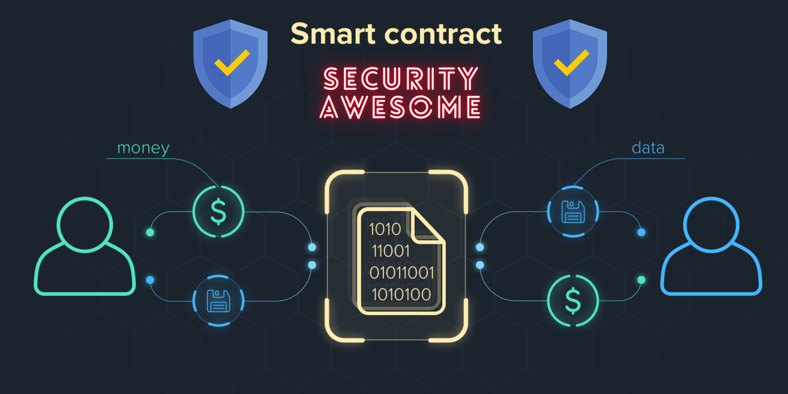

# Awesome-Smart-Contract-Security 

# Table of Contents
- [Blogs](#blogs)
- [Papers](#papers)
- [Books](#books)
- [Trainings](#Trainings)
- [Tools](#tools)
  * [Visualization](#Visualization)
  * [Verification](#Verification)
  * [Linters](#Linters)
  * [BugHunting](#BugHunting)
  * [Reverse Engineering](#Reverse_Engineering)

- [Awesome-Smart-Contract-Security !awesome](#awesome-smart-contract-security-)
- [Table of Contents](#table-of-contents)
- [Blogs](#blogs)
- [Papers](#papers)
- [Books](#books)
    - [Security Journal list](#security-journal-list)
- [Trainings](#trainings)
- [Tools](#tools)
    - [Visualization](#visualization)
    - [Verification](#verification)
    - [Linters](#linters)
    - [BugHunting](#bughunting)
    - [Reverse Engineering](#reverse-engineering)
- [Labs](#labs)
- [Capture the Flag and Wargames](#capture-the-flag-and-wargames)
- [Talks](#talks)
- [Misc](#misc)
- [Podcasts](#podcasts)
- [Cheat Sheets](#cheat-sheets)
- [Checklists](#checklists)
- [Bug Bounty & Writeups](#bug-bounty--writeups)
- [Bug Bounty Platforms & Project](#bug-bounty-platforms--project)
# Blogs

* [Reversing Ethereum Smart Contracts](https://arvanaghi.com/blog/reversing-ethereum-smart-contracts/)
* [Emin Gün Sirer, professor in Cornell Tech’s IC3 lab focused on blockchain security.](http://hackingdistributed.com/) 
* [ Phil Daian, grad student behind KEVM, Hydra, and other Ethereum academic projects](https://pdaian.com/blog/) 
* [Cybersecurity R&D firm with a blockchain security practice](https://blog.trailofbits.com/) 
* [ Martin Swende, programmer and appsec consultant](http://swende.se/) 
* [Company blog about security issues and practices within blockchain ecosystem](https://blog.smartdec.net/) 
* [Solidity Security: Comprehensive list of known attack vectors](https://blog.sigmaprime.io/solidity-security.html)
* [Use cryptography in mobile apps the right way](https://blog.oversecured.com/Use-cryptography-in-mobile-apps-the-right-way/)
* [Subzero is an HSM-backed method for cold storage of Bitcoin developed by Square](https://medium.com/square-corner-blog/open-sourcing-subzero-ee9e3e071827) 
* [Contract upgrade anti-patterns](https://blog.trailofbits.com/2018/09/05/contract-upgrade-anti-patterns/)
* [How the winner got Fomo3D prize — A Detailed Explanation](https://medium.com/coinmonks/how-the-winner-got-fomo3d-prize-a-detailed-explanation-b30a69b7813f)
* [How to debug Solidity Smart Contracts with Tenderly and Truffle](https://medium.com/tenderly/how-to-debug-solidity-smart-contracts-with-tenderly-and-truffle-da995cfe098f)
* [Lashing out at a Spank Channel](https://medium.com/coinmonks/lashing-out-at-a-spank-channel-2b42b23f0dc6)
* [Malicious GasToken Minting](https://medium.com/level-k/public-disclosure-malicious-gastoken-minting-236b2f8ace38)
* [Missing return value bug in ERC20 tokens](https://medium.com/coinmonks/missing-return-value-bug-at-least-130-tokens-affected-d67bf08521ca)
* [Not A Fair Game – Fairness Analysis of Dice2win](http://blogs.360.cn/post/Fairness_Analysis_of_Dice2win_EN.html)
* [Initial Formal Verification of Ethereum Casper Protocol](https://runtimeverification.com/blog/runtime-verification-completes-formal-verification-of-ethereum-casper-protocol/)
* [Security considerations for Shamir's secret sharing](https://ethresear.ch/t/security-considerations-for-shamirs-secret-sharing/4294)
* [SmartDec smart contract audit beginner's guide](https://blog.smartdec.net/smartdec-smart-contract-audit-beginners-guide-d04cc7f1c571)
* [The Anatomy of a Block Stuffing Attack](https://osolmaz.com/2018/10/18/anatomy-block-stuffing/)
* [The phenomenon of smart contract honeypots](https://medium.com/@gerhard.wagner/the-phenomena-of-smart-contract-honeypots-755c1f943f7b)
* [Use our suite of Ethereum security tools](https://blog.trailofbits.com/2018/03/23/use-our-suite-of-ethereum-security-tools/)
* [Vertcoin (VTC) was successfully 51% attacked](https://medium.com/coinmonks/vertcoin-vtc-is-currently-being-51-attacked-53ab633c08a4)

# Papers
* [Security Strengths and Weaknesses of Blockchain Smart Contract System: A Survey](https://www.researchgate.net/profile/Malaw-Ndiaye/publication/360624196_Security_Strengths_and_Weaknesses_of_Blockchain_Smart_Contract_System_A_Survey/links/62824c3590841d5155d7dbb7/Security-Strengths-and-Weaknesses-of-Blockchain-Smart-Contract-System-A-Survey.pdf)
* [Ethereum smart contract security research: survey and future research opportunities](https://link.springer.com/article/10.1007/s11704-020-9284-9)
* [Smart contract security: A software lifecycle perspective](https://ieeexplore.ieee.org/iel7/6287639/8600701/08864988.pdf)
* [Ethainter: a smart contract security analyzer for composite vulnerabilities](https://dl.acm.org/doi/abs/10.1145/3385412.3385990)
* [NeuCheck: A more practical Ethereum smart contract security analysis tool](https://onlinelibrary.wiley.com/doi/abs/10.1002/spe.2745)
* [Smart contract: Attacks and protections](https://ieeexplore.ieee.org/abstract/document/8976179/)
* [Smart contract vulnerability analysis and security audite](https://ieeexplore.ieee.org/abstract/document/9143290/)
* [Security analysis methods on ethereum smart contract vulnerabilities: a survey](https://arxiv.org/pdf/1908.08605)
* [Smart contract privacy protection using AI in cyber-physical systems: tools, techniques and challenges](https://ieeexplore.ieee.org/iel7/6287639/8948470/08976143.pdf)
* [LedgerHedger: Gas Reservation for Smart-Contract Security](https://eprint.iacr.org/2022/056.pdf)
* [Combining graph neural networks with expert knowledge for smart contract vulnerability detection](https://arxiv.org/pdf/2107.11598)
* [Security checklists for Ethereum smart contract development: patterns and best practices](https://arxiv.org/pdf/2008.04761.pdf)
* [Exploring Security Practices of Smart Contract Developers](https://arxiv.org/pdf/2204.11193)

# Books

 * [Fundamentals of Smart Contract Security](https://www.amazon.com/Fundamentals-Smart-Contract-Security-Richard/dp/194944936X)
 * [Hands-On Smart Contract Development with Solidity and Ethereum ](https://www.oreilly.com/library/view/hands-on-smart-contract/9781492045250/ch12.html)
 * [Mastering Ethereum](https://www.bookstack.cn/read/ethereumbook-en/a09dd11523647de0.md)

### Security Journal list

* IEEE Transactions on Information Forensics and Security [[web]](http://ieeexplore.ieee.org/xpl/RecentIssue.jsp?punumber=10206)
* Computer & Security[[web]](http://www.elsevier.com/wps/find/journaldescription.cws_home/405877/description#description)
* IET Information Security[[web]](http://www.ietdl.org/IET-IFS)
* ACM Transactions on Information and System Security[[web]](http://tissec.acm.org/)
* International Journal of Information Security[[web]](http://www.springerlink.com/content/107927/)
* Security and Communication Networks[[web]](http://www.wiley.com/bw/journal.asp?ref=1939-0114)
* IEEE Security & Privacy[[web]](	http://www.computer.org/portal/web/security/home)
* IEEE Transactions on Dependable and Secure Computing [[web]](http://www.computer.org/tdsc/)
* Security and Communication Networks[[web]](http://onlinelibrary.wiley.com/journal/10.1002/(ISSN)1939-0122)
* Computer Fraud & Security[[web]](http://www.elsevierscitech.com/nl/cfs/home.asp )

# Trainings

* [SEC554: Blockchain and Smart Contract Security](https://www.sans.org/cyber-security-courses/blockchain-smart-contract-security/)
* [SecDim](https://www.sans.org/cyber-security-courses/blockchain-smart-contract-security/)
* [Ethereum Smart Contract Security](https://secdim.com)
* [Solidity, Blockchain, and Smart Contract Course ](https://www.youtube.com/watch?v=M576WGiDBdQ)

* [Smart Contract Security 101](https://pro.eattheblocks.com/p/smart-contract-security-101)
* [Certified Blockchain Security Professional (CBSP)](https://blockchaintrainingalliance.com/products/cbsp)
* [Learn blockchain security](https://www.infosecinstitute.com/skills/learning-paths/blockchain-security/)
# Tools
### Visualization

* [ethereum-graph-debugger](https://github.com/fergarrui/ethereum-graph-debugger) - A graphical EVM debugger. Displays the entire program control flow graph.
* [Slither](https://github.com/trailofbits/slither) - Slither can map method visibility and modifiers, state variables that are read and written, calls, and can print the inheritance graph of a smart contract
* [Solgraph](https://github.com/raineorshine/solgraph) - Generates DOT graphs with function control flow of a solidity contract
* [Surya](https://github.com/ConsenSys/surya) - Generates various visual outputs of function call graphs
* [sol-function-profiler](https://github.com/EricR/sol-function-profiler) - Solidity contract function profiler

### Verification 

* [KEVM](https://github.com/kframework/evm-semantics) - K Semantics of the Ethereum Virtual Machine (EVM)
* [Manticore](https://github.com/trailofbits/manticore) - Symbolic execution tool for EVM

### Linters

* [Remix](https://remix.ethereum.org/) - Browser-based Solidity IDE with linting features
* [SmarrtCheck](https://tool.smartdec.net/) - A linter for Solidity and Vyper that checks code for security issues and bad practices.
* [Solhint](https://github.com/protofire/solhint) - Linter for both security and style-guide validations. It strictly adheres to the [Solidity Style Guide](https://solidity.readthedocs.io/en/latest/style-guide.html).
* [Solium](https://github.com/duaraghav8/Solium) - Linter for both security and style-guide validations. Does not strictly adhere to the Solidity Style Guide.
### BugHunting

* [Echidna](https://github.com/trailofbits/echidna) - Fuzzer for Ethereum smart contracts. Uses property testing to generate malicious inputs that break smart contracts.
* [Manticore](https://github.com/trailofbits/manticore) - Symbolic execution tool for Ethereum smart contracts that includes detectors for common security flaws
* [Mythril OSS](https://github.com/ConsenSys/mythril/) - Open-source security analysis tool for Ethereum smart contracts built around detector modules
* [Securify v2.0](https://github.com/eth-sri/securify2) - Static analysis tool from ChainSecurity
* [Slither](https://github.com/trailofbits/slither) - Static analysis framework, written in Python, with detectors for many common Solidity issues
* [Octopus](https://github.com/pventuzelo/octopus) - : Blockchain Smart Contracts (BTC/ETH/NEO/EOS)
### Reverse Engineering

* [abi-decompiler](https://github.com/beched/abi-decompiler) - EVM reverse engineering helper utility
* [ethereum-dasm](https://github.com/tintinweb/ethereum-dasm) - EVM disassembler with static and dynamic analysis abilities, including function signature lookup
* [Ethersplay](https://github.com/trailofbits/ethersplay) - Visual disassembler for EVM bytecode built on Binary Ninja
* [evmlab](https://github.com/ethereum/evmlab) - Utilities for interacting with the Ethereum virtual machine
* [IDA-EVM](https://github.com/trailofbits/ida-evm) - IDA plugin to view EVM instructions
* [Panoramix](http://eveem.org/about)
* [pyevmasm](https://github.com/trailofbits/pyevmasm) - EVM assembler and disassembler with a CLI and a Python API
* [Rattle](https://github.com/trailofbits/rattle) - EVM binary static analysis framework. Produces SSA representations of EVM code.
# Labs

* [Smart Contract Labs](https://smartcontractlabs.ee/)  
* [ChainLink Lab](https://chainlinklabs.com/)
* [A lab that focuses on smart contract security](https://github.com/JonZeolla/lab-SmartContractSecurity)

# Capture the Flag and Wargames

* [Capture the Ether](https://capturetheether.com/)  
* [The Ethernaut](https://ethernaut.openzeppelin.com/)  
* [Etherhack](https://etherhack.positive.com/)  
* [Security Innovation Blockchain CTF](https://blockchain-ctf.securityinnovation.com/)  
* [Ciphershastra CTF](https://ciphershastra.com/)  
* [Defi Hack](https://www.defihack.xyz/)  
* [Gacha Lab (BSC Testnet)](https://gachalab.inspex.co/)
# Talks
  

| Title | Conference | Year |
| --- | --- | --- |
|[6th Workshop on Trusted Smart Contracts](https://fc22.ifca.ai/wtsc/) | WTSC 2022 | 2022| 
|[Smart Contract Security: a Practitioners’ Perspective](https://conf.researchr.org/details/icse-2021/icse-2021-papers/12/Smart-Contract-Security-a-Practitioners-Perspective) | ICSE 2021 |2021|
| [Predicting Random Numbers in Ethereum Smart Contracts](https://schd.ws/hosted_files/appseccalifornia2018/00/AppSecCali%202018%20-%20Predicting%20Random%20Numbers%20in%20Ethereum%20Smart%20Contracts.pdf) | OWASP AppSec | 2018 |
| [Blockchain Autopsies - Analyzing Smart Contract Deaths](https://github.com/trailofbits/publications/tree/master/presentations/Blockchain%20Autopsies%20-%20Analyzing%20Smart%20Contract%20Deaths) | Blackhat USA | 2018 |
| [Rattle - an EVM binary analysis framework](https://www.trailofbits.com/presentations/rattle/) | reCON | 2018 |
| [Blackhat Ethereum](https://github.com/trailofbits/publications/blob/master/presentations/Blackhat%20Ethereum) | CanSecWest | 2018 |
| [Smashing Ethereum Smart Contracts for Fun and Profit](https://github.com/b-mueller/smashing-smart-contracts) | HITB Amsterdam | 2018 |
| [Automatic Bug Finding for the Blockchain](https://github.com/trailofbits/publications/blob/master/presentations/Automatic%20bugfinding%20for%20the%20blockchain) | EkoParty | 2017 |
# Misc

* [Hacking Smart Contracts: Beginners Guide](https://learn.block6.tech/hacking-smart-contracts-beginners-guide-9c84e9de7194)
* [Security Pitfalls & Best Practices 101](https://secureum.substack.com/p/security-pitfalls-and-best-practices-101?s=r)
* [A guide to smart contract security best practices](https://github.com/ConsenSys/smart-contract-best-practices)    
* [Decentralized Application Security Project (or DASP) Top 10](https://www.dasp.co/)
* [Solidity Security Considerations](https://docs.soliditylang.org/en/latest/security-considerations.html)
* [A Collection of Vulnerabilities in ERC20 Smart Contracts](https://github.com/sec-bit/awesome-buggy-erc20-tokens)
* [Examples of Solidity security issues](https://github.com/crytic/not-so-smart-contracts)
* [A guide to smart contract security best practices](https://github.com/ConsenSys/smart-contract-best-practices)
* [A guide to EOS smart contract security best practices](https://github.com/slowmist/eos-smart-contract-security-best-practices)
# Podcasts

* [CoinSec Podcast](https://coinsecpodcast.com/)
* [The Smartest Contract](http://www.thesmartestcontract.com/)
* [Zero Knowledge](http://www.zeroknowledge.fm/)

# Cheat Sheets 
* [Solidity Cheat Sheet](https://intellipaat.com/blog/tutorial/blockchain-tutorial/solidity-cheat-sheet/)
* [Solidity Cheatsheet and Best practices](https://github.com/manojpramesh/solidity-cheatsheet)
* [Ethereum Cheat Sheet](https://intellipaat.com/blog/tutorial/blockchain-tutorial/ethereum-cheat-sheet/)
* [The Ultimate Blockchain Cheat Sheet](https://101blockchains.com/blockchain-cheat-sheet/)
# Checklists
* [Solidity Auditing Checklistt](https://github.com/cryptofinlabs/audit-checklist)
* [SMART CONTRACT SECURITY CHECKLIST](https://ethereum.org/en/developers/tutorials/secure-development-workflow/)
* [Smart Contract Security Audit: Intro & Top 5 Best Practices](https://www.getastra.com/blog/security-audit/smart-contract-security/)
* [Smart Contract Security Verification Standard](https://securing.github.io/SCSVS/)
* [Security checklists for Ethereum smart contract development](https://arxiv.org/pdf/2008.04761)

# Bug Bounty & Writeups

* [Hands on the Ethernaut CTF](https://blog.trailofbits.com/2017/11/06/hands-on-the-ethernaut-ctf/) - Writeups for various Ethernaut CTF challenge contracts.
* [Ethernaut - Naught Coin (ERC20) Exploitation](https://medium.com/coinmonks/ethernaut-naught-coin-erc20-exploitation-218c86bb953b) - Writeup for a vulnerable ERC20 from the Ethernaut CTF.
* [EtherHack CTF Writeup](https://blog.positive.com/phdays-8-etherhack-contest-writeup-794523f01248) - Writeup for EtherHack CTF challenges.
* [PolySwarm Smart Contract Hacking Challenge Writeup](https://raz0r.name/writeups/polyswarm-smart-contract-hacking-challenge-writeup/) - Demonstrates advanced use of Manticore

* [Write up of Metaplex Vuln 2022](https://github.com/Bonfida/metaplex-vulnerability-012022)
* [Smart Contract security audit reports](https://github.com/TechRate/Smart-Contract-Audits)
# Bug Bounty Platforms & Project
* [Immunefi](https://immunefi.com/explore/)
* [hackenproof](https://hackenproof.com/)
* [ETHEREUM Bounty Program](https://bounty.ethereum.org/#bounty-scope)
* [Etherscan Bugbounty Program](https://etherscan.io/bugbounty)
* [Parity Bug Bounty Program](https://www.parity.io/bug-bounty/)
* [Gitcoint project](https://gitcoin.co/explorer?network=mainnet&idx_status=open&applicants=ALL&order_by=-web3_created)
* [Code Arena Bugbounty project](https://code4rena.com/)
* [Smartlink Dapps](https://www.smartlink.so/bug-bounty/)

